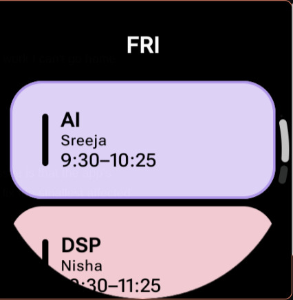

# Bunkialo

Bunkialo is an Expo React Native app for IIIT Kottayam students that aggregates Moodle attendance, assignment timeline, timetable, mess menu, and utility tools.

Bunkialo landing is the Next.js onboarding page for Bunkialo, in bunkialo-landing folder.

## License

This project is licensed under **GPL-3.0**.

meaning: if you fork and distribute a modified version, you must also provide source code for that modified version under GPL-compatible terms. Distributed derivatives cannot be closed source.

## Quick Start

### Prerequisites

- Bun
- Expo CLI / EAS CLI

### Install

```bash
bun install
```

### Environment

Copy `.env.example` into `.env`.

LMS test variables are optional and only needed if you run the test scripts:

- `LMS_TEST_USERNAME`
- `LMS_TEST_PASSWORD`

### Run

```bash
bunx expo start
```

### Android development build

Download the latest Android development APK from the [GitHub Releases page](https://github.com/Noelithub77/bunkialo2/releases), install it on an Android device, and use the EAS Update preview link from the matching pull request.

## Wear OS app

The native Wear OS timetable extension lives in [`wear-os/`](wear-os/). It is a separate Kotlin/Compose app inside this repository, using the package `com.codialo.bunkialo`.



The watch uses the built-in timetable template by default. A small pen icon at the bottom of each day's timetable opens the timetable editor on the paired phone through Bunkialo. From there, the phone can send one of these timetable sources to the watch:

- **Template timetable** — the hard-coded timetable shipped with the Wear OS app (the default).
- **Current account timetable** — the signed-in account's current timetable from Bunkialo.
- **Manual timetable** — timetable entries edited directly on the phone.

The phone includes a **Reset to template** action. It removes the phone-supplied timetable and restores the built-in timetable from [`Timetable.kt`](wear-os/app/src/main/java/com/codialo/bunkialo/schedule/Timetable.kt). The watch also has the same reset action, so the default template remains available even when a phone is not connected.

The phone/watch connection uses the [Wear OS Data Layer](https://developer.android.com/training/wearables/data/overview) and sends only the display timetable data to the watch. The watch does not receive Moodle credentials, cookies, attendance records, or other account secrets. Opening the editor from the watch uses Android's [`RemoteActivityHelper`](https://developer.android.com/reference/androidx/wear/remote/interactions/RemoteActivityHelper) to launch Bunkialo on the phone; the phone must have the Bunkialo app installed and the watch must be paired for the handoff to work.

### Build and deploy

```bash
cd wear-os
JAVA_HOME=/opt/android-studio/jbr ./gradlew :app:assembleDebug
```

For a connected Wear OS watch, use the deployment scripts:

```bash
./scripts/deploy-dev
./scripts/deploy-prod
```

Production deployment requires the signing variables documented in [`wear-os/AGENTS.md`](wear-os/AGENTS.md). The phone-side editor requires a native Android development or production build so the `wear-timetable` module is included; it is not available in Expo Go.

## Omarchy plugin

Install only the plugin with Omarchy's plugin CLI:

```bash
omarchy plugin add https://github.com/Noelithub77/bunkialo2.git --enable --yes
```

This installs and enables Bunkialo, but does not change your Hyprland
keybindings. For the complete setup, including `SUPER+B`, `SUPER+SHIFT+B`,
shell reload, and config validation, run this from a clone:

```bash
git clone https://github.com/Noelithub77/bunkialo2.git
cd bunkialo2
./scripts/setup-omarchy.sh
```

If you do not want to clone the repository, the same setup is available as a
single command:

```bash
curl -fsSL https://raw.githubusercontent.com/Noelithub77/bunkialo2/main/scripts/setup-omarchy.sh | bash
```

The setup script is idempotent: it installs or enables the plugin, adds the
shortcuts once, reloads Hyprland, and checks for config errors. For more
details, see
[`omarchy-plugin/README.md`](omarchy-plugin/README.md).

## Scripts

- `bun test` (unit tests against app modules)
- `bun run test:lms-scraper`
- `bun run test:dashboard`
- `bun run test:resources`
- `bun run test:downloads`
- `bun run test:assignment`
- `bun run test:assignment-submit` (uploads only with explicit `--submit`)
- `bun run test:e2e:assignment`
- `bun run test:e2e:feedback`

## Contributing

Please read [`.github/CONTRIBUTING.md`](.github/CONTRIBUTING.md) before opening pull requests.

## Security

Please report vulnerabilities through GitHub private vulnerability reporting. See [`.github/SECURITY.md`](.github/SECURITY.md).
